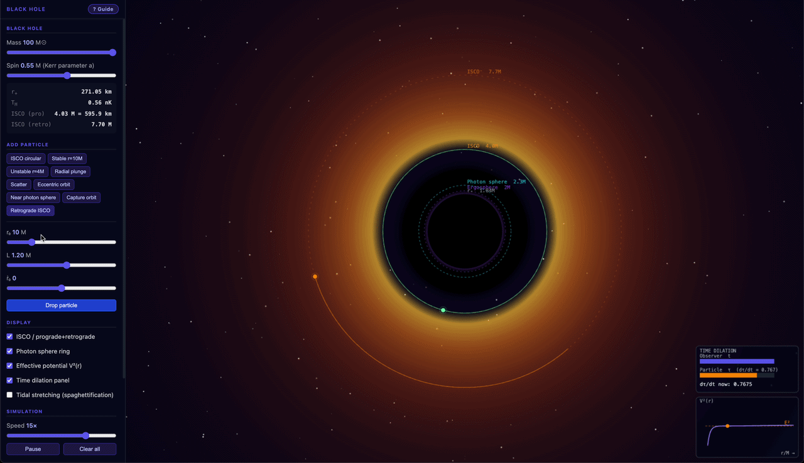

# Black Hole Orbital Simulator

**[Live demo](https://kartava.github.io/black-hole-orbital-simulator/)**

An interactive 2D orbital mechanics simulator based on real General Relativity mathematics. Visualizes test-particle geodesics around Schwarzschild and Kerr (spinning) black holes in the equatorial plane.



## Features

- **Schwarzschild & Kerr black holes** — adjust mass (1–100 M☉) and spin parameter _a_ (0–0.99 M) in real time
- **RK4 geodesic integration** — 4th-order Runge-Kutta integration of exact Boyer-Lindquist equations of motion
- **Particle presets** — ISCO circular, stable/unstable circular, radial plunge, scatter, eccentric (shows GR perihelion precession), near photon sphere, capture, retrograde ISCO
- **Custom spawn** — set initial radius _r₀_, angular momentum _L_, and radial velocity _ṙ_ to drop any geodesic
- **Effective potential V²(r) plot** — live panel showing the radial potential well with the particle's energy level and current position
- **Time dilation panel** — compares proper time τ against coordinate time _t_, showing dτ/dt in real time
- **Tidal stretching** — optional spaghettification ellipse scaled by the Riemann curvature |R^r_trt| = 2M/r³
- **Kerr features** — ergosphere region, dual ISCO rings (prograde + retrograde), frame-dragging effects
- **SI readouts** — event horizon radius (km) and Hawking temperature (nK/μK) update live with mass and spin

## Controls & Interface

### Canvas

| Action               | Effect                                                                     |
| -------------------- | -------------------------------------------------------------------------- |
| **Scroll wheel**     | Zoom in / out                                                              |
| **Click a particle** | Select it — activates the V²(r) and time dilation panels for that particle |

### Black Hole

| Control             | What it does                                                                                                                                                                                                         |
| ------------------- | -------------------------------------------------------------------------------------------------------------------------------------------------------------------------------------------------------------------- |
| **Mass** (1–100 M☉) | Sets the physical mass of the black hole. Affects the scale of all orbits, the Hawking temperature, and the Schwarzschild radius shown in km.                                                                        |
| **Spin** (0–0.99 M) | Kerr spin parameter _a_. At 0 the spacetime is Schwarzschild. Increasing spin shrinks the prograde ISCO, enlarges the retrograde ISCO, adds an ergosphere (purple shaded region), and cools the Hawking temperature. |

The readout below the sliders shows:

- **r₊** — event horizon radius in km (physical scale for the chosen mass)
- **T_H** — Hawking temperature (spinning black holes are cooler than non-spinning ones of equal mass)
- **ISCO (pro/retro)** — innermost stable circular orbit radius in units of M and km

### Add Particle — Presets

Click any preset button to instantly spawn a particle on a specific geodesic:

| Preset                 | Description                                                                                                           |
| ---------------------- | --------------------------------------------------------------------------------------------------------------------- |
| **ISCO circular**      | Circular orbit at the innermost stable radius — the last stable orbit before inspiral.                                |
| **Stable r=10M**       | Circular orbit at a comfortable 10 M, well outside the ISCO.                                                          |
| **Unstable r=4M**      | Circular orbit between the photon sphere and ISCO — tiny perturbations cause it to spiral in or out.                  |
| **Radial plunge**      | Dropped from rest with zero angular momentum; falls straight in.                                                      |
| **Scatter**            | Incoming particle with enough angular momentum to swing around and escape to infinity.                                |
| **Eccentric orbit**    | Bound elliptical-like orbit; watch the orbit axis precess (GR analogue of Mercury's perihelion precession).           |
| **Near photon sphere** | Orbit just outside the unstable photon circular orbit; slowly spirals away.                                           |
| **Capture orbit**      | Comes in at an angle with just too little angular momentum to escape — captured.                                      |
| **Retrograde ISCO**    | Circular orbit at the retrograde ISCO, spinning opposite to the black hole. Only differs from prograde when spin > 0. |

### Add Particle — Custom Spawn

Fine-tune the initial conditions before clicking **Drop particle**:

| Parameter | Meaning                                                                                                                                                 |
| --------- | ------------------------------------------------------------------------------------------------------------------------------------------------------- |
| **r₀**    | Initial radius in units of M. Must be outside the event horizon. The _L_ slider auto-updates to the circular-orbit value at this radius.                |
| **L**     | Specific angular momentum (conserved quantity). Positive = prograde, negative = retrograde. Higher magnitude = wider orbit. Set to 0 for a radial fall. |
| **ṙ₀**    | Initial radial velocity dṙ/dτ. 0 = start on a circular or turning-point trajectory. Negative = falling inward, positive = moving outward.               |

The energy _E_ is not a free parameter — it is solved exactly from the Kerr geodesic equations given r₀, L, and ṙ₀.

### Display Toggles

| Toggle                         | What it shows                                                                                                                                                                                          |
| ------------------------------ | ------------------------------------------------------------------------------------------------------------------------------------------------------------------------------------------------------ |
| **ISCO / prograde+retrograde** | Dashed amber rings at the prograde (and retrograde, if spin > 0) ISCO radii.                                                                                                                           |
| **Photon sphere ring**         | Dashed cyan ring at the unstable photon circular orbit.                                                                                                                                                |
| **Effective potential V²(r)**  | Bottom-right panel: the radial potential well for the selected particle. The dashed line is the particle's energy E²; the dot is its current position. Classically allowed motion is where E² ≥ V²(r). |
| **Time dilation panel**        | Shows two bars: observer coordinate time _t_ (always full) and particle proper time τ. The ratio dτ/dt approaches 0 near the horizon (extreme time dilation).                                          |
| **Tidal stretching**           | Replaces the particle dot with an ellipse elongated along the radial direction, scaled by the tidal curvature 2M/r³. Illustrates spaghettification.                                                    |

### Simulation

| Control            | Effect                                               |
| ------------------ | ---------------------------------------------------- |
| **Speed** (1–20×)  | Simulation speed multiplier relative to real time.   |
| **Pause / Resume** | Freeze the simulation without losing particle state. |
| **Clear all**      | Remove all particles from the canvas.                |

### Selected Particle Readout

After clicking a particle or adding one, the readout at the bottom of the sidebar shows:

| Field           | Meaning                                                                                                |
| --------------- | ------------------------------------------------------------------------------------------------------ |
| **r**           | Current radial coordinate in units of M.                                                               |
| **L**           | Conserved specific angular momentum (constant throughout the geodesic).                                |
| **E**           | Conserved specific energy (constant throughout the geodesic; E > 1 means unbound).                     |
| **dτ/dt (now)** | Instantaneous ratio of proper time to coordinate time. 1 = no dilation; approaches 0 near the horizon. |
| **τ proper**    | Total proper time elapsed for the particle since it was spawned.                                       |
| **t coord**     | Total coordinate time elapsed — what a distant observer measures.                                      |

## Physics

All formulas are sourced from standard GR references (Bardeen 1972, Misner-Thorne-Wheeler, Chandrasekhar). Geometric units G = c = 1, M = 1.

| Quantity            | Formula                                     |
| ------------------- | ------------------------------------------- |
| Kerr event horizon  | r₊ = M + √(M²−a²)                           |
| ISCO radius         | Bardeen-Press-Teukolsky formula             |
| Photon orbit        | r_ph = 2M(1 + cos(⅔ arccos(∓a/M)))          |
| Radial potential    | R(r) = P² − Δ(Q²+r²), P=(r²+a²)E−aL, Q=L−aE |
| dφ/dτ               | [2aME + L(r−2M)] / (r·Δ)                    |
| dt/dτ               | [(r²+a²+2Ma²/r)E − (2Ma/r)L] / Δ            |
| Hawking temperature | ℏc³√(1−a²) / (4πGMk_B(1+√(1−a²)))           |

## Getting Started

**Requirements:** Node.js 18+, Yarn

```bash
git clone https://github.com/kartava/black-hole-orbital-simulator.git
cd black-hole-orbital-simulator
yarn install
yarn dev
```

Open [http://localhost:5173](http://localhost:5173) in your browser.

### Build for production

```bash
yarn build
```

Output goes to `dist/` and can be served by any static file host.

## Project Structure

```
src/
  physics.ts    — Pure GR math: Kerr geodesics, orbit parameters, horizon/ISCO/photon radii, Hawking temperature
  particles.ts  — Particle class (RK4 integration, trail, proper/coordinate time), color cycler
  controls.ts   — Sidebar: preset table, sliders, event wiring, returns per-frame readout updater
  renderer.ts   — Canvas 2D: starfield, accretion disk, rings, labels, V²(r) and time dilation panels
  types.ts      — Shared interfaces (SimulationState, Camera, DisplayOptions, SpawnState)
  main.ts       — Entry point: state, animation loop, resize, input events
  assets/
    styles.css  — UI styles
```

## Tech Stack

- **Vite** — dev server and bundler
- TypeScript (no framework)
- HTML5 Canvas 2D

## License

MIT
